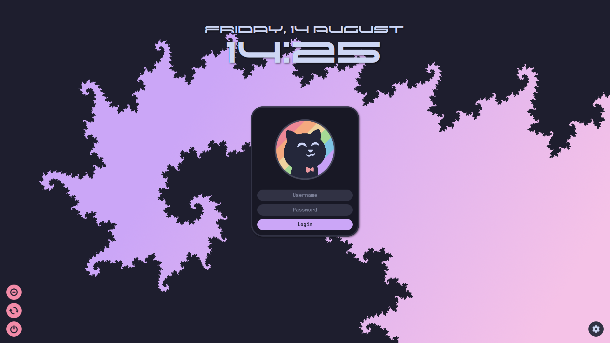
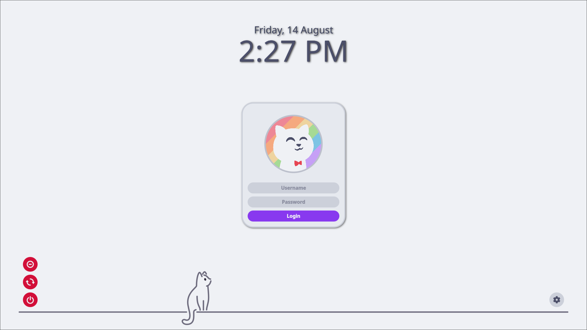
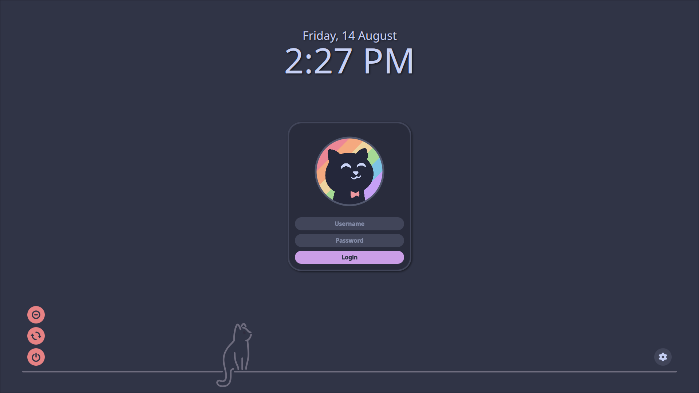
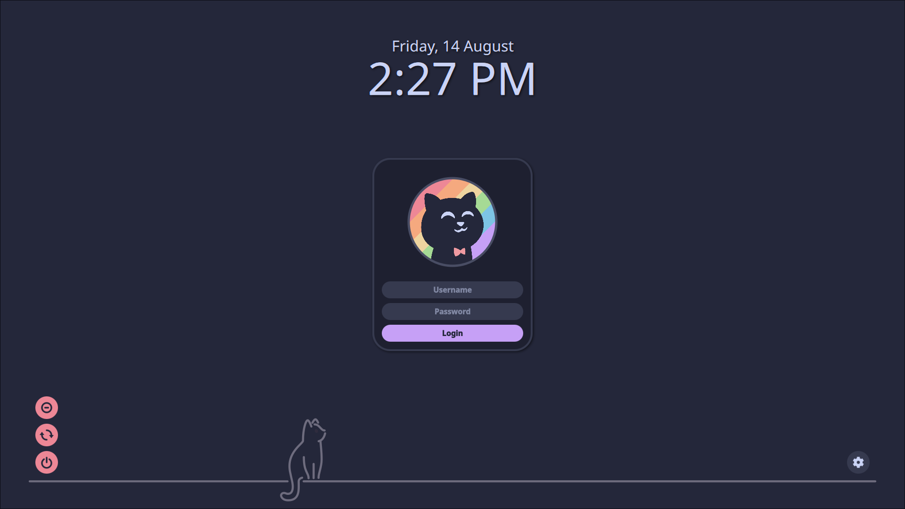
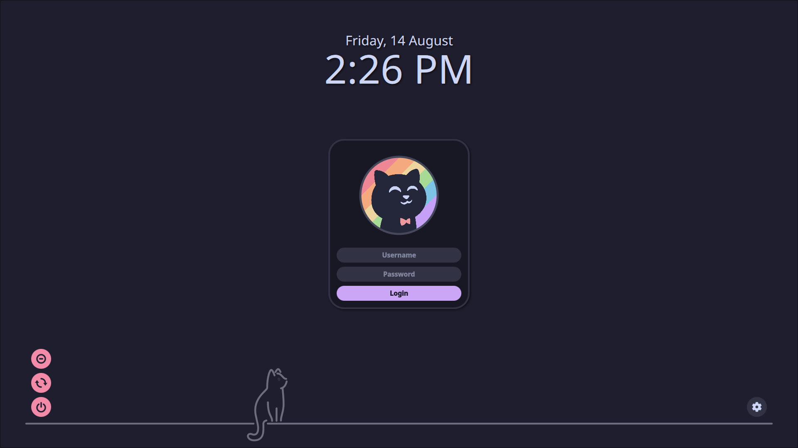

<!--

# TODO:
- make options to make the clock look like Pop2
 - text stroke
 - coloured gradient shadow

- redo readme instructions

-->

<h3 align="center">
 <br/>
 
 Catppuccin Rounded for <a href="https://github.com/sddm/sddm/">SDDM</a>
 
</h3>

<p align="center">
    <a href="https://github.com/Destructor-Ben/sddm-theme/stargazers"></a>
    <a href="https://github.com/Destructor-Ben/sddm-theme/issues"></a>
    <a href="https://github.com/Destructor-Ben/sddm-theme/contributors"></a>
</p>

<p align="center">
  
</p>

## Previews

<details>
<summary>🌻 Latte</summary>

</details>
<details>
<summary>🪴 Frappé</summary>

</details>
<details>
<summary>🌺 Macchiato</summary>

</details>
<details>
<summary>🌿 Mocha</summary>

</details>
<details>
<summary>My Personal Theme</summary>

</details>

## Usage

1. Ensure you have installed the [dependencies](#dependencies) for your operating system.
2. Download your chosen flavour + accent zip file from the [latest GitHub release](https://github.com/Destructor-Ben/sddm-theme/releases/latest).
3. Unzip the file and move the resulting directory to `/usr/share/sddm/themes/`. E.g. to copy `catppuccin-mocha-mauve`:

    ```bash
    sudo mv -v catppuccin-mocha-mauve /usr/share/sddm/themes
    ```

4. Edit the `/etc/sddm.conf` file and change the theme to `catppuccin-<flavour>-<accent>`. For example, `catppuccin-mocha-mauve`.

   If you don't have this file, create the `/etc/sddm.conf` file and add the following lines:

   ```conf
   [Theme]
   Current=catppuccin-mocha-mauve
   ```

5. Unfortunately, the theme does not work properly if SDDM is run on X11 and not Wayland - follow the instructions [here](https://wiki.archlinux.org/title/SDDM#Wayland) here if there are issues. 

## Dependencies

### Arch Based OS

```bash
pacman -Syu qt6-svg qt6-declarative qt5-quickcontrols2
```

### Debian Based OS

```bash
apt install --no-install-recommends qml-module-qtquick-layouts qml-module-qtquick-controls2 qml-module-qtquick-window2 libqt6svg6
```

### RPM Based OS

```bash
dnf install qt6-qtquickcontrols2 qt6-qtsvg
```

### Solus OS

```bash
eopkg install qt6-quickcontrols2 qt6-svg
```

### NixOS

This theme is available through this flake:
```nix
# TODO: flake example
```

Add the package to systemPackages, you can customize the theme by overriding the attributes:

```nix
environment.systemPackages = [(
  pkgs.catppuccin-sddm.override {
    flavor = "mocha";
    accent = "mauve";
    # allThemes = true; # Instead of specifying a single theme, you can install all themes
    # The theme name used when installing just one theme is "catppuccin-rounded", whilst with all of them, it is "catppuccin-rounded-{flavor}-{accent}"
    # TODO: add config options here once ready for real
    font  = "Noto Sans";
    fontSize = "9";
    background = "${./wallpaper.png}";
    loginBackground = true;
  }
)];
```

Then set it as the theme in the sddm configuration, change the suffix to the flavor and accent you set in the package override:

TODO: show how it is supposed to be done
```nix
displayManager.sddm = {
  enable = true;
  theme = "catppuccin-mocha-mauve";
  package = pkgs.kdePackages.sddm;
};
```

## Configuration

Read through the <a href="templates/theme.tera">config file</a> to see the config options.

The icons default to using power icons from Papirus.

## 💝 Thanks to

- [DonutDev](https://github.com/DonutDev)
- [Isabelinc](https://github.com/Isabelincorp)
- [Isabel Roses](https://github.com/isabelroses)
- [a9lim](https://github.com/a9lim)

&nbsp;

<p align="center"></p>
<p align="center">Copyright &copy; 2021-present <a href="https://github.com/catppuccin" target="_blank">Catppuccin Org</a>
<p align="center">Copyright &copy; 2026-present <a href="https://github.com/catppuccin" target="_blank">Destructor_Ben</a>
<p align="center"><a href="https://github.com/catppuccin/catppuccin/blob/main/LICENSE"></a></p>
